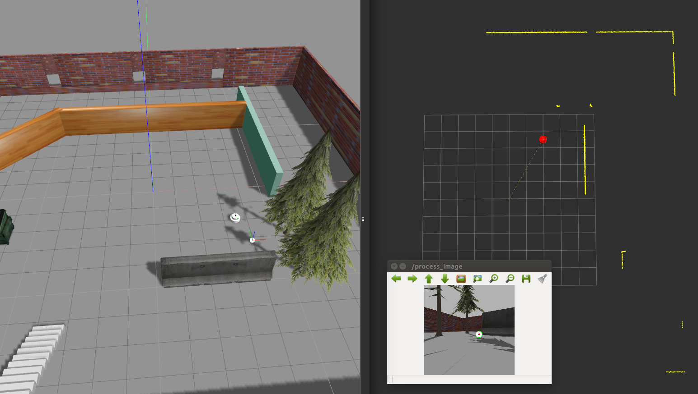
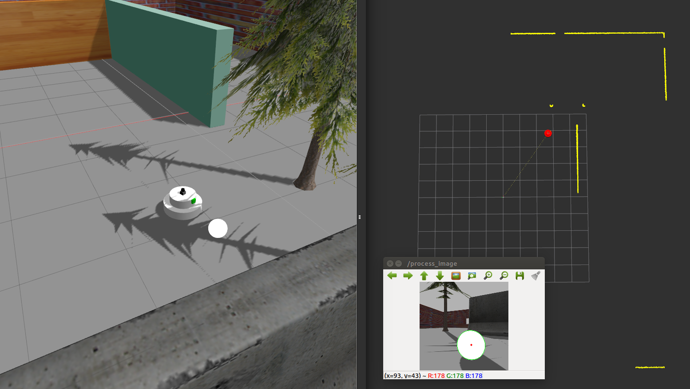

# Go Chase It

## Contents
There are 2 packages:<br>
* **ball_chaser** is for detection of a white ball, and motion planning.
* **my_robot** contains gazebo environemnts for the robot.

Note that some example snapshots of the robot simulator can be found inside the folder **results/**.

## Usage<br>
#### Step 1<br>
Open a new terminal, and launch this command to bringup the robot simulator.<br>
```
$ roslaunch my_robot world.launch
```
#### Step 2
Open another new terminal to launch the ball following algorithm.
```
$ roslaunch ball_chaser ball_chaser.launch
```

## Example Snapshots
#### Step 1
<br>
#### Step 2
<br>
